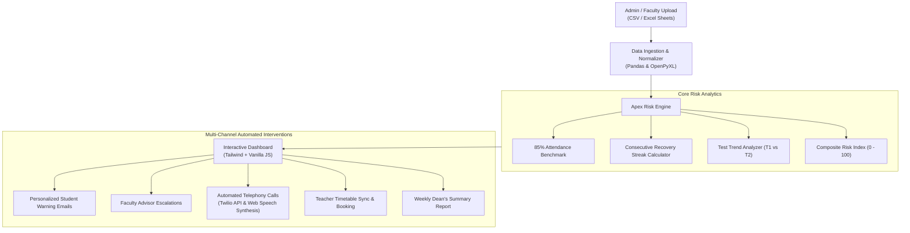

# 🎓 Apex RiskEngine: AI-Powered Student Risk Management & Intervention Suite

> **Hackathon Solution for Education Problem Statement**  
> An automated, real-time student attendance monitoring, early warning, mathematical recovery forecasting, and multi-channel intervention system.

[](https://www.python.org/)
[](https://fastapi.tiangolo.com)
[](https://tailwindcss.com)
[](LICENSE)

[](https://mileage-gold-seek-mirror.trycloudflare.com)

> 🔗 **Live Hosted System for Judges:** [https://mileage-gold-seek-mirror.trycloudflare.com](https://mileage-gold-seek-mirror.trycloudflare.com)  
> *(Fully functional live URL with real-time file upload, recovery calculations, interactive phone dialer, email preview, and appointment booking)*

---

## 🌟 Overview & Problem Statement

In academic institutions, students frequently face course debarment or academic failure simply because attendance and performance deficits are discovered too late in the semester. 

**Apex RiskEngine** solves this by creating an automated end-to-end early warning and intervention pipeline:
1. **Multi-Format Ingestion:** Ingests faculty attendance sheets and test performance files (CSV & Excel `.xlsx`).
2. **85% Policy Enforcement:** Flags any student at or below the mandatory 85% attendance or performance benchmark.
3. **Mathematical Recovery Streaks:** Calculates the exact non-negotiable number of consecutive upcoming classes each student must attend to cross back over 85%.
4. **Performance Trajectory Tracking:** Flags students with weak scores (< 50%) or declining trajectories ($\text{Test 2} < \text{Test 1}$).
5. **Personalized Warning Emails:** Generates and dispatches individualized email alerts with tailored recovery guidance.
6. **Faculty & Advisor Alerts:** Escalates flagged cohorts to designated department advisors and subject teachers.
7. **Teacher Timetable Integration:** Connects at-risk students with instructor office hours for instant 1-on-1 counseling slot reservations.
8. **Interactive Automated Telephony:** Places outbound automated voice calls to students below 85% with audio speech synthesis and call logging.
9. **Executive Dean's Summary Reports:** Delivers weekly institutional risk analytics, department breakdowns, and printable PDF reports.

---

## 📐 Mathematical Recovery Formula

The core innovation of Apex RiskEngine is its non-linear recovery streak algorithm.

Given:
* $A$ = Number of classes attended so far
* $T$ = Total classes conducted to date
* $P_{\text{target}} = 0.85$ (85% Target Threshold)
* $x$ = Number of consecutive upcoming classes the student must attend without missing any

The requirement is:
$$\frac{A + x}{T + x} \ge 0.85$$

Multiplying across:
$$A + x \ge 0.85(T + x) = 0.85T + 0.85x$$

Rearranging terms:
$$(1 - 0.85)x \ge 0.85T - A$$
$$0.15x \ge 0.85T - A$$
$$x = \left\lceil \frac{0.85T - A}{0.15} \right\rceil$$

### Concrete Example:
For a student with **24 attended classes out of 36** ($66.67\%$ attendance):
$$x = \left\lceil \frac{0.85 \times 36 - 24}{0.15} \right\rceil = \left\lceil \frac{30.6 - 24}{0.15} \right\rceil = \left\lceil \frac{6.6}{0.15} \right\rceil = \lceil 44.0 \rceil = \mathbf{44 \text{ consecutive classes}}$$

*Proof:* $\frac{24 + 44}{36 + 44} = \frac{68}{80} = 85.00\%$. The student safely achieves 85%.

---

## 🏗️ System Architecture



---

## 🛠️ Tech Stack & Frameworks

| Layer | Technologies Used | Rationale |
|---|---|---|
| **Backend Framework** | **FastAPI (Python 3.12)** | Ultra-fast ASGI server, async request handling, auto-generated OpenAPI docs. |
| **Data Ingestion** | **Pandas, OpenPyXL** | Robust parser for CSV, XLS, and XLSX with forgiving column matching. |
| **Frontend UI** | **HTML5, Tailwind CSS, FontAwesome** | Responsive dark-mode glassmorphic aesthetic; zero compilation build step needed. |
| **Telephony / Voice** | **Web Speech API & Twilio Voice API** | Live interactive speech synthesis in the browser + real Twilio SIP trunk support. |
| **Templating** | **Jinja2** | High-performance server-side rendering for instant page hydration. |
| **Deployment** | **Docker, Render, Vercel, Uvicorn** | Instant 1-click cloud readiness and containerization. |

---

## 🚀 Quick Start (Local Setup in 60 Seconds)

### 1. Clone Repository & Install Dependencies
```bash
git clone https://github.com/venkatasaimeka2006/Apex-RiskEngine.git
cd Apex-RiskEngine
pip install -r requirements.txt
```

### 2. Run the Application
```bash
python run.py
```
Open your browser at **`http://localhost:8000`**.

### 3. Run Automated Tests
```bash
python test_app.py
```

---

## 🌐 Cloud Deployment Options

### Deploy to Render (Recommended - Free & Fast)
1. Push code to GitHub.
2. Link repo in [Render](https://render.com) as a **Web Service**.
3. Build Command: `pip install -r requirements.txt`
4. Start Command: `uvicorn app.main:app --host 0.0.0.0 --port $PORT`
*(Or use the provided `render.yaml` for 1-click infrastructure as code)*.

### Deploy with Docker
```bash
docker build -t apex-risk-engine .
docker run -p 8000:8000 apex-risk-engine
```

---

## 🧪 Judge Walkthrough & Verification Steps

1. **Test Data Ingestion:**
   * Go to **"Upload Attendance & Marks"**.
   * Download `combined_student_data.csv`, `attendance_sample.csv`, or `test_results_sample.csv`.
   * Re-upload the file to verify the parsing pipeline.
2. **Examine Risk Calculations:**
   * Review student **Aarav Sharma** ($66.7\%$ attendance $\to$ flagged **CRITICAL** $\to$ needs **44 consecutive classes**).
   * Review student **Devansh Chawla** (Test 1: 48%, Test 2: 35% $\to$ flagged **Declining Marks & Critical Risk**).
3. **Test Automated Voice Call:**
   * Click the **Phone button** next to Aarav Sharma.
   * Listen to the browser's synthetic voice synthesize the urgent attendance warning aloud, view the live transcript, and inspect the logged Call SID in the **Automated Telephony Logs** tab.
4. **Test Warning Emails:**
   * Click **"Warn All At-Risk"** in the top bar.
   * Switch to the **Email Warning Dispatch** tab and click **"Preview Email"** to inspect the personalized student letter.
5. **Test Faculty Timetable Booking:**
   * Switch to **"Teacher Timetable & Booking"**.
   * Reserve an open green slot with instructor Dr. Aris Thorne. Notice the slot locks to **BOOKED** with a confirmation token.
6. **Inspect Weekly Summary:**
   * Open the **"Weekly Dean's Report"** tab or click **"Open Printable / PDF View"**.

---

## 📄 License
This project is open-source under the MIT License.
